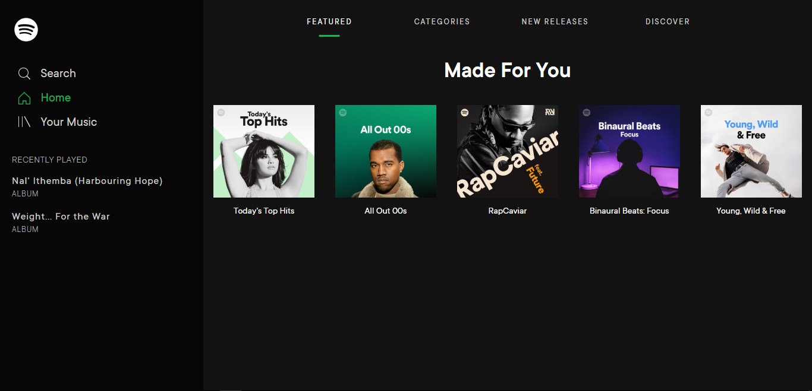
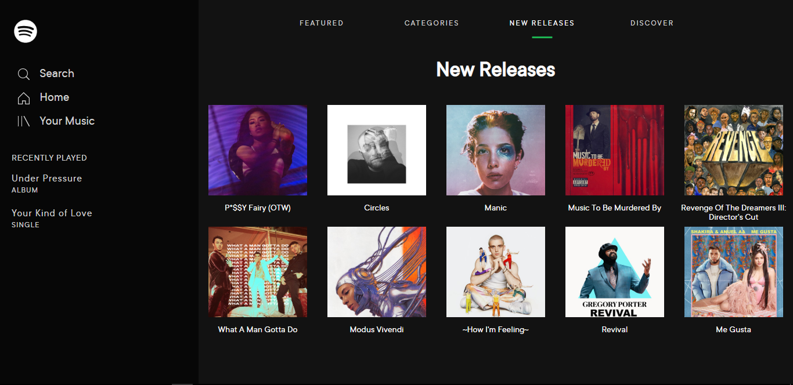

# SPOTIFY APP CLONE
Built by **Nhlakanipho Mkhabela**

Using React to build the Spotify client-side

Depending on Redux and Redux Thunk for state management and async actions

Using Axios to communicate with the server

Finally - using Node and Express to build the backend

[View live](https://thirsty-cray-5b0954.netlify.com)

### Things to note

 - Supported **media queries** (1300px - 1500px)
 - This application is not responsive, as the focus is committed to React. 
 - Exceeding the supported **media queries** will lead to unwanted bugs as I use the flexbox wrap method instead of css-grid to align the playlists.

---

### How to run file

 ##### Clone the directory to your local machine, follow these directions
 
 - cd into the Spotify directory
 - run npm install
 - run npm start

[View the server side repo](https://github.com/Nhlakaa/OAuthSpotify)

